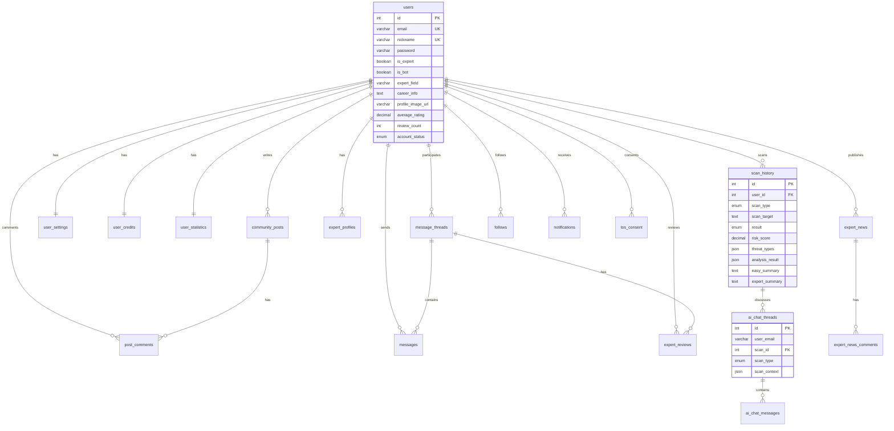

<div align="center">


# 🛡️ 피싱가드 (Phishing Guard)

**URL · 문자 · 이메일 · QR코드 · 보이스피싱 통합 보안 검사 플랫폼**

*by 보안방범대 (TionLab/HCILab)*

[](https://nextjs.org/)
[](https://fastapi.tiangolo.com/)
[](https://www.mysql.com/)
[](https://pytorch.org/)
[](https://docs.docker.com/compose/)

</div>

---

## 📋 목차

- [프로젝트 소개](#-프로젝트-소개)
- [주요 기능](#-주요-기능)
- [기술 스택](#-기술-스택)
- [시스템 아키텍처](#-시스템-아키텍처)
- [프로젝트 구조](#-프로젝트-구조)
- [ML 모델](#-ml-모델)
- [데이터베이스 스키마](#-데이터베이스-스키마)
- [설치 및 실행](#-설치-및-실행)
- [API 문서](#-api-문서)
- [환경 변수 설정](#-환경-변수-설정)
- [배포](#-배포)
- [라이선스](#-라이선스)

---

## 🎯 프로젝트 소개

**피싱가드**는 다양한 유형의 피싱 공격을 탐지하고 분석하는 **통합 보안 검사 플랫폼**입니다. 머신러닝 모델과 AI 기반 분석을 결합하여 URL, 문자메시지(SMS), 이메일, QR코드, 보이스피싱 등 **5가지 유형**의 피싱 위협을 실시간으로 검사합니다.

일반 사용자를 위한 **쉬운 모드**와 보안 전문가를 위한 **전문가 모드**를 동시에 제공하며, 커뮤니티와 전문가 상담 시스템을 통해 사용자 간 정보 공유 및 전문적인 보안 상담이 가능합니다.

### 핵심 가치

| 🔍 다중 스캐너 | 🤖 AI 분석 | 👥 커뮤니티 | 🎓 전문가 연결 |
|:---:|:---:|:---:|:---:|
| URL, SMS, 이메일, QR, 음성 5종 분석 | KoBERT/RoBERTa + GPT 하이브리드 | 위협 정보 공유 게시판 | 1:1 보안 전문가 상담 |

---

## ✨ 주요 기능

### 🔎 통합 스캐너 (5종)

<table>
<tr>
<td width="20%"><b>🌐 URL 분석</b></td>
<td>
  리디렉션 체인 추적 → 피싱 DB 대조 → ML 모델 분석 (Random Forest) → AI 콘텐츠 분석 (GPT) → SSL 인증서 검증 → 스크린샷 캡처 순의 <b>다단계 신뢰도 점수 분석</b>
</td>
</tr>
<tr>
<td><b>💬 SMS 분석</b></td>
<td>
  한국어(KoBERT)·영어(RoBERTa) 이중 언어 지원 ML 분류 → URL 추출 후 URL 분석 연계 → GPT 종합 분석
</td>
</tr>
<tr>
<td><b>📧 이메일 분석</b></td>
<td>
  이메일 본문 AI 분석 → 내장 URL 자동 추출 및 분석 → 피싱 패턴 탐지
</td>
</tr>
<tr>
<td><b>📱 QR코드 분석</b></td>
<td>
  카메라 실시간 스캔 / 이미지 업로드 → AI 피싱 확률 예측 → URL 포함 시 URL 분석 연계 → 큐싱(Qshing) 위협 탐지
</td>
</tr>
<tr>
<td><b>🎙️ 보이스피싱 분석</b></td>
<td>
  음성 파일 업로드 → AI 기반 음성 내용 분석 → 보이스피싱 패턴 탐지
</td>
</tr>
</table>

### 🤖 AI 채팅 상담

- 검사 결과 기반 **맞춤형 AI 상담** (OpenAI GPT 연동)
- 스레드 기반 **대화 이력 관리**
- 쉬운 모드 / 전문가 모드 지원

### 👥 커뮤니티

- **정보**, **질문**, **일반** 카테고리 게시글
- 댓글 기능과 조회수 기반 인기글 정렬
- 검사 결과를 공유하여 커뮤니티에 경고글 작성

### 🎓 전문가 시스템

- **전문가 프로필** 및 전문 분야, 경력 정보 관리
- **1:1 메시지 상담** (파일 첨부 지원)
- **전문가 리뷰/평점** 시스템 (1~5점)
- **전문가 뉴스/리포트** 작성 및 게시
- 팔로우 시스템

### 📊 트렌드

- 최신 **보안 뉴스** 및 전문가 리포트
- 인기 커뮤니티 게시글 랭킹

### 👤 사용자 시스템

- 이메일 기반 회원가입/로그인 (NextAuth.js)
- **프로필 이미지** 업로드 및 관리
- **크레딧 시스템** (월 100회 검사 할당)
- 검사 이력 저장 및 통계 대시보드
- 테마 설정 (라이트/다크/시스템)

---

## 🛠 기술 스택

### Frontend

| 기술 | 버전 | 용도 |
|:---|:---:|:---|
| **Next.js** | 16 | React 기반 풀스택 프레임워크 |
| **React** | 19 | UI 라이브러리 |
| **TypeScript** | 5.8 | 타입 안전성 |
| **Tailwind CSS** | 4.1 | 유틸리티 CSS 프레임워크 |
| **Framer Motion** | 12.29 | 애니메이션 라이브러리 |
| **NextAuth.js** | 4.24 | 인증/인가 |
| **Recharts** | 3.7 | 차트 시각화 |
| **Lucide React** | 0.563 | 아이콘 라이브러리 |
| **html5-qrcode** | 2.3 | QR 코드 스캐너 |

### Backend

| 기술 | 버전 | 용도 |
|:---|:---:|:---|
| **FastAPI** | 0.115 | 고성능 비동기 API 서버 |
| **Uvicorn** | 0.32 | ASGI 서버 |
| **PyTorch** | 2.1 | ML 모델 추론 |
| **Transformers** (HuggingFace) | - | KoBERT, RoBERTa 모델 |
| **OpenAI API** | 1.54 | GPT 기반 AI 분석 |
| **Playwright** | 1.48 | 웹 스크린샷 캡처 |
| **BeautifulSoup4** | 4.12 | HTML 파싱 |
| **scikit-learn** | - | Random Forest 모델 |
| **MySQL Connector** | 9.1 | DB 연결 |

### Database & Infra

| 기술 | 버전 | 용도 |
|:---|:---:|:---|
| **MySQL** | 8.0 | 관계형 데이터베이스 |
| **Docker Compose** | 3.8 | 컨테이너 오케스트레이션 |
| **systemd** | - | 프로세스 관리 (프로덕션) |

---

## 🏗 시스템 아키텍처

```
┌─────────────────────────────────────────────────────────────────┐
│                         Client (Browser)                        │
│              PC / Mobile Responsive Design                      │
└──────────────────────────┬──────────────────────────────────────┘
                           │
                           ▼
┌──────────────────────────────────────────────────────────────────┐
│                    Frontend (Next.js 16)                         │
│                    Port: 3000                                    │
│  ┌──────────┐  ┌──────────┐  ┌──────────┐  ┌───────────────┐   │
│  │ Scanner  │  │Community │  │  Expert  │  │   AI Chat     │   │
│  │ (5 Types)│  │  Board   │  │  System  │  │   Interface   │   │
│  └──────────┘  └──────────┘  └──────────┘  └───────────────┘   │
│  ┌──────────┐  ┌──────────┐  ┌──────────┐  ┌───────────────┐   │
│  │  Trends  │  │  MyPage  │  │ Messages │  │   Settings    │   │
│  └──────────┘  └──────────┘  └──────────┘  └───────────────┘   │
└──────────────────────────┬──────────────────────────────────────┘
                           │ REST API
                           ▼
┌──────────────────────────────────────────────────────────────────┐
│                    Backend (FastAPI)                              │
│                    Port: 8000                                     │
│  ┌──────────────────────────────────────────────────────────┐    │
│  │                    Analysis Tools                         │    │
│  │  ┌─────┐  ┌─────┐  ┌─────┐  ┌───────┐  ┌───────────┐   │    │
│  │  │ URL │  │ SMS │  │ QR  │  │ Email │  │  Voice    │   │    │
│  │  └──┬──┘  └──┬──┘  └──┬──┘  └───┬───┘  └─────┬─────┘   │    │
│  │     │        │        │         │             │          │    │
│  │  ┌──▼──────────────────▼─────────▼─────────────▼──┐      │    │
│  │  │  ML Models (PyTorch) + OpenAI GPT + Playwright │      │    │
│  │  └────────────────────────────────────────────────┘      │    │
│  └──────────────────────────────────────────────────────────┘    │
│  ┌──────────┐  ┌──────────┐  ┌──────────┐                       │
│  │Community │  │  Admin   │  │ AI Chat  │                       │
│  │  Router  │  │  Router  │  │  Engine  │                       │
│  └──────────┘  └──────────┘  └──────────┘                       │
└──────────────────────────┬──────────────────────────────────────┘
                           │
                           ▼
┌──────────────────────────────────────────────────────────────────┐
│                    Database (MySQL 8.0)                           │
│                    Port: 3306                                     │
│  ┌──────────┐  ┌──────────┐  ┌──────────┐  ┌───────────────┐   │
│  │  users   │  │  scans   │  │community │  │  messages    │   │
│  │ credits  │  │ history  │  │  posts   │  │  ai_chat     │   │
│  │ settings │  │  stats   │  │ comments │  │  reviews     │   │
│  │ consent  │  │          │  │ notific. │  │             │   │
│  └──────────┘  └──────────┘  └──────────┘  └───────────────┘   │
└──────────────────────────────────────────────────────────────────┘
```

---

## 📁 프로젝트 구조

```
project/
├── 📄 docker-compose.yml          # Docker 컨테이너 오케스트레이션
├── 📄 docker-compose.dev.yml      # 개발 환경 오버라이드
├── 📄 docker-manager.sh           # Docker 서비스 관리 스크립트
├── 📄 service-manager.sh          # systemd 서비스 관리 스크립트
│
├── 🎨 frontend/                   # Next.js 프론트엔드
│   ├── app/
│   │   ├── page.tsx               # 메인 페이지 (커뮤니티 피드)
│   │   ├── layout.tsx             # 루트 레이아웃 (SEO, 메타데이터)
│   │   ├── ClientLayout.tsx       # 클라이언트 레이아웃 (사이드바, 네비게이션)
│   │   ├── not-found.tsx          # 404 페이지
│   │   ├── scanner/               # 통합 스캐너 페이지
│   │   ├── auth/                  # 로그인 / 회원가입
│   │   │   ├── signin/
│   │   │   └── signup/
│   │   ├── community/             # 커뮤니티 (글쓰기, 상세, 수정)
│   │   ├── trends/                # 트렌드 (뉴스, 인기글)
│   │   ├── experts/               # 전문가 목록 및 프로필
│   │   ├── expert/                # 전문가 대시보드
│   │   ├── expert-news/           # 전문가 뉴스 (목록, 작성, 수정)
│   │   │   ├── page.tsx           #   뉴스 목록
│   │   │   ├── write/             #   뉴스 작성
│   │   │   └── edit/[id]/         #   뉴스 수정
│   │   ├── ai-chat/               # AI 채팅 상담
│   │   ├── messages/              # 1:1 메시지 상담
│   │   ├── mypage/                # 마이페이지 (통계, 히스토리)
│   │   ├── search/                # 통합 검색 페이지
│   │   ├── settings/              # 설정 (테마, 알림)
│   │   └── api/                   # Next.js API Routes
│   │       ├── auth/              # NextAuth 인증
│   │       ├── user/              # 사용자 CRUD
│   │       ├── community/         # 커뮤니티 API
│   │       │   └── comments/      #   댓글 CRUD
│   │       ├── expert/            # 전문가 API
│   │       ├── messages/          # 메시지 API
│   │       ├── news/              # 뉴스 API
│   │       │   └── comments/      #   뉴스 댓글 CRUD
│   │       ├── notifications/     # 알림 API
│   │       ├── search/            # 검색 API
│   │       └── posts/             # 게시글 API (인기글 등)
│   ├── components/
│   │   ├── Header.tsx             # 상단 네비게이션
│   │   ├── Sidebar.tsx            # 사이드바 메뉴
│   │   ├── MobileNav.tsx          # 모바일 하단 네비게이션
│   │   ├── LoadingScreen.tsx      # 로딩 화면
│   │   ├── ConsentModal.tsx       # 개인정보/이용약관 동의 모달
│   │   ├── SessionProvider.tsx    # NextAuth 세션 프로바이더
│   │   └── scanner/
│   │       ├── ScannerTabs.tsx    # 스캐너 탭 선택
│   │       ├── inspectors/        # 스캐너 입력 컴포넌트
│   │       │   ├── UrlInspector.tsx
│   │       │   ├── SmsInspector.tsx
│   │       │   ├── EmailInspector.tsx
│   │       │   ├── QrInspector.tsx
│   │       │   └── VoiceInspector.tsx
│   │       └── results/           # 결과 표시 컴포넌트
│   │           ├── ResultDisplay.tsx
│   │           ├── UrlAnalysisDetail.tsx
│   │           ├── EmailResult.tsx
│   │           └── SummarySection.tsx
│   ├── hooks/
│   │   ├── useUserProfile.ts     # 프로필 데이터 훅
│   │   └── useSecurityHelmet.tsx  # 보안 보호 훅 (DevTools 차단 등)
│   ├── lib/
│   │   ├── auth.ts               # NextAuth 설정
│   │   ├── db.ts                 # MySQL 커넥션 풀
│   │   ├── helpContents.ts       # 도움말 콘텐츠 정의
│   │   └── nickname-generator.ts # 랜덤 닉네임 생성기
│   ├── database/
│   │   └── complete.sql          # 전체 DB 스키마
│   ├── public/
│   │   ├── logo.png              # 피싱가드 로고
│   │   ├── done.mp3              # 검사 완료 효과음
│   │   ├── models/               # 클라이언트 배포용 모델 파일
│   │   └── test/                 # 테스트 샘플 파일 (QR, 음성)
│   └── package.json
│
├── ⚙️ backend/                    # FastAPI 백엔드
│   ├── main.py                    # 메인 앱 + API 엔드포인트
│   ├── routers/
│   │   ├── community.py           # 커뮤니티 라우터
│   │   └── model_demo.py          # ML 모델 데모 페이지 (SMS/URL 실시간 테스트)
│   ├── tools/
│   │   ├── url/                   # URL 분석 도구
│   │   │   ├── analyzer.py        # 메인 분석 파이프라인
│   │   │   ├── config.py          # URL 분석 설정
│   │   │   └── steps/             # 분석 단계별 모듈
│   │   │       ├── phishing_db.py       # 피싱 DB 대조
│   │   │       ├── redirect_checker.py  # 리디렉션 추적
│   │   │       ├── content_analyzer.py  # AI 콘텐츠 분석
│   │   │       ├── ssl_verifier.py      # SSL 인증서 검증
│   │   │       ├── ml_analyzer.py       # ML 모델 분석
│   │   │       ├── screenshot_capturer.py # 스크린샷 캡처
│   │   │       └── feature_extractors/  # ML 피처 추출
│   │   │           ├── type1_features.py # Type1 피처 추출
│   │   │           └── type2_features.py # Type2 피처 추출
│   │   ├── sms/
│   │   │   └── analyzer.py        # SMS 분석 (KoBERT + RoBERTa)
│   │   ├── qr/
│   │   │   ├── analyzer.py        # QR 코드 분석
│   │   │   ├── ai_vision.py       # AI 비전 기반 QR 분석
│   │   │   ├── qr_decoder.py      # QR 디코딩
│   │   │   └── qr_utils.py        # QR 유틸리티
│   │   ├── email/
│   │   │   └── analyzer.py        # 이메일 분석
│   │   └── voice/
│   │       └── analyzer.py        # 음성 분석
│   ├── utils/
│   │   ├── logging_config.py      # 컬러 로깅 설정
│   │   └── summary_generator.py   # AI 요약 생성
│   ├── static/                    # 정적 파일 (FastAPI 서빙)
│   │   ├── profile/               # 사용자 프로필 이미지
│   │   ├── screenshots/           # URL 스크린샷 캡처 저장
│   │   └── uploads/               # 첨부파일 업로드 저장
│   ├── data/
│   │   ├── phishing/              # 피싱 URL 데이터셋 (ISCX, KISA)
│   │   └── short/                 # 단축 URL 목록
│   ├── requirements.txt
│   └── Dockerfile
│
└── 🧠 models/                     # ML 모델 학습 코드
    ├── SMS/                        # SMS 피싱 탐지 모델
    │   ├── en/                     # 영어 모델 (RoBERTa-large)
    │   │   ├── model.py            # RoBERTa 분류기 정의
    │   │   ├── train.py            # 학습 스크립트
    │   │   ├── evaluate.py         # 평가 스크립트
    │   │   ├── predict.py          # 추론 스크립트
    │   │   ├── analyze.py          # 성능 분석 시각화
    │   │   ├── config.py           # 하이퍼파라미터
    │   │   ├── data_loader.py      # 데이터 로더
    │   │   └── dataset.csv         # 학습 데이터셋
    │   └── ko/                     # 한국어 모델 (KoBERT)
    │       ├── model.py            # KoBERT 분류기 정의
    │       ├── train.py            # 학습 스크립트
    │       ├── evaluate.py         # 평가 스크립트
    │       ├── predict.py          # 추론 스크립트
    │       ├── analyze.py          # 성능 분석 시각화
    │       ├── config.py           # 하이퍼파라미터
    │       ├── data_loader.py      # 데이터 로더
    │       └── dataset.csv         # 학습 데이터셋
    └── LINK/                       # URL 피싱 탐지 모델
        ├── type1/                  # Type 1 Random Forest
        │   ├── random_forest_model.py
        │   └── dataset_type1.csv
        ├── type2/                  # Type 2 Random Forest
        │   ├── random_forest_model.py
        │   └── dataset_type2.csv
        └── output/                 # 학습된 모델 파일
            ├── type1_rf_model.pkl
            ├── type2_rf_model.pkl
            └── label_encoders.pkl
```

---

## 🧠 ML 모델

### SMS 피싱 탐지

| 모델 | 대상 | 아키텍처 | 설명 |
|:---|:---|:---|:---|
| **KoBERT** | 한국어 SMS | `skt/kobert-base-v1` + Linear(768→2) | 한국어 스미싱 문자 이진 분류 |
| **RoBERTa** | 영어 SMS | `roberta-large` + Linear(1024→2) | 영어 피싱 문자 이진 분류 |

- 자동 언어 감지 후 해당 모델 적용
- 텍스트 내 URL 자동 추출 → URL 분석 연계
- GPT 기반 종합 위험도 평가

### URL 피싱 탐지

| 모델 | 유형 | 알고리즘 | 설명 |
|:---|:---|:---|:---|
| **Type 1 RF** | URL 특성 분석 | Random Forest | URL 구조적 패턴 기반 분류 |
| **Type 2 RF** | URL 특성 분석 | Random Forest | 확장 피처 기반 분류 |

- 두 모델의 분석 결과를 종합하여 신뢰도 점수 산출
- 피싱 DB 대조, SSL 검증, AI 콘텐츠 분석과 결합한 다단계 분석

### 분석 파이프라인

```
                   ┌─────────────────┐
    URL 입력 ──▶   │  Step 0: 리디렉션 │ ──▶ 리디렉션 체인 추적
                   │    추적          │
                   └────────┬────────┘
                            ▼
                   ┌─────────────────┐
                   │ Step 1: 피싱 DB  │ ──▶ Known 피싱 URL 매칭
                   │    대조          │
                   └────────┬────────┘
                            ▼
                   ┌─────────────────┐
                   │Step 1.5: ML 모델 │ ──▶ Random Forest 예측
                   │    분석          │
                   └────────┬────────┘
                            ▼
                   ┌─────────────────┐
                   │ Step 2: AI 콘텐츠│ ──▶ GPT 기반 페이지 분석
                   │    분석          │
                   └────────┬────────┘
                            ▼
                   ┌─────────────────┐
                   │ Step 3: SSL 검증 │ ──▶ 인증서 유효성 확인
                   │                  │
                   └────────┬────────┘
                            ▼
                   ┌─────────────────┐
                   │Step 4: 스크린샷  │ ──▶ Playwright 캡처
                   │    캡처          │
                   └────────┬────────┘
                            ▼
                   ┌─────────────────┐
                   │ 최종: 신뢰도 점수 │ ──▶ SAFE / SUSPICIOUS / DANGER
                   │    산출          │
                   └─────────────────┘
```

---

## 🗄 데이터베이스 스키마

총 **16개 테이블**로 구성된 MySQL 데이터베이스:



### 주요 테이블 설명

| 테이블 | 설명 |
|:---|:---|
| `users` | 사용자 정보 (일반/전문가/봇) |
| `scan_history` | 스캔 결과 이력 (5종 타입, JSON 분석 결과) |
| `user_credits` | 월간 크레딧 관리 (100회/월) |
| `user_statistics` | 스캔 통계 (종류별, 기간별 집계) |
| `user_settings` | 테마, 효과음, 공유 설정 |
| `ai_chat_threads` / `ai_chat_messages` | AI 채팅 스레드 및 메시지 |
| `community_posts` / `post_comments` | 커뮤니티 게시글 및 댓글 |
| `expert_profiles` | 전문가 프로필 (전문 분야, 상담비) |
| `expert_news` / `expert_news_comments` | 전문가 뉴스 및 댓글 |
| `message_threads` / `messages` | 1:1 상담 (파일 첨부 지원) |
| `expert_reviews` | 전문가 리뷰/평점 (1~5점) |
| `follows` | 전문가 팔로우 |
| `credit_history` | 크레딧 사용 이력 |
| `notifications` | 알림 (댓글, 메시지, 뉴스 댓글 등) |
| `tos_consent` | 개인정보/이용약관 동의 기록 |

---

## 🚀 설치 및 실행

### 사전 요구사항

- **Node.js** 18+
- **Python** 3.10+
- **MySQL** 8.0+
- **Docker** & **Docker Compose** (Docker 배포 시)

### 방법 1: Docker Compose (권장)

```bash
# 1. 저장소 클론
git clone https://github.com/tionlab/project.git
cd project

# 2. 환경 변수 설정
cp .env.docker .env
# .env 파일에서 DB 비밀번호, OpenAI API 키 등 수정

# 3. Docker 서비스 시작
./docker-manager.sh start

# 4. 개발 모드 (Hot Reload)
./docker-manager.sh dev
```

#### Docker 관리 명령어

```bash
./docker-manager.sh start     # 프로덕션 모드 시작
./docker-manager.sh dev       # 개발 모드 시작 (Hot Reload)
./docker-manager.sh stop      # 서비스 중지
./docker-manager.sh restart   # 서비스 재시작
./docker-manager.sh rebuild   # Docker 이미지 재빌드
./docker-manager.sh status    # 서비스 상태 확인
./docker-manager.sh logs backend   # 특정 서비스 로그 확인
./docker-manager.sh shell backend  # 특정 서비스 셸 접속
./docker-manager.sh cleanup   # 전체 정리 (컨테이너, 볼륨 삭제)
```

### 방법 2: 로컬 직접 실행

```bash
# 1. 데이터베이스 초기화
mysql -u root -p < frontend/database/complete.sql

# 2. 백엔드 설정
cd backend
pip install -r requirements.txt
playwright install chromium    # 스크린샷 캡처용
cp .env.example .env          # 환경 변수 설정

# 3. 백엔드 실행
python main.py                 # http://localhost:8000

# 4. 프론트엔드 설정 (새 터미널)
cd frontend
npm install
cp .env.local.example .env.local  # 환경 변수 설정

# 5. 프론트엔드 실행
npm run dev                    # http://localhost:4200
```

### 방법 3: systemd 서비스 (프로덕션)

```bash
# 서비스 설치 및 시작
./service-manager.sh install
./service-manager.sh start

# 서비스 관리
./service-manager.sh status    # 상태 확인
./service-manager.sh restart   # 재시작
./service-manager.sh logs backend  # 로그 확인
```

---

## ⚙️ 환경 변수 설정

### Backend (`backend/.env`)

```env
# 데이터베이스
DB_HOST=localhost
DB_USER=your_db_user
DB_PASSWORD=your_db_password
DB_NAME=your_db_name

# OpenAI API
OPENAI_API_KEY=sk-your-api-key
```

### Frontend (`frontend/.env.local`)

```env
# API 서버 주소
NEXT_PUBLIC_API_URL=http://localhost:8000

# NextAuth 설정
NEXTAUTH_SECRET=your-secret-key
NEXTAUTH_URL=http://localhost:4200

# 데이터베이스 (API Routes에서 사용)
DB_HOST=localhost
DB_USER=your_db_user
DB_PASSWORD=your_db_password
DB_NAME=your_db_name
```

### Docker (`/.env.docker`)

```env
DB_ROOT_PASSWORD=your_root_password
DB_NAME=your_db_name
DB_USER=your_db_user
DB_PASSWORD=your_db_password
OPENAI_API_KEY=sk-your-api-key
```

---

## 🌐 배포

### 포트 구성

| 서비스 | 포트 | 설명 |
|:---|:---:|:---|
| Frontend | `3000` | Next.js 앱 서버 |
| Backend | `8000` | FastAPI API 서버 |
| Database | `3306` | MySQL 서버 |

### CORS 설정

백엔드에 허용된 오리진은 `backend/main.py`에서 관리됩니다. 배포 환경에 맞게 수정하세요:

```python
allow_origins=[
    "https://your-domain.com",
    "http://localhost:4200",
]
```


---

<div align="center">


**피싱가드 - 보안방범대**

</div>
